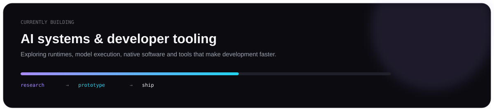
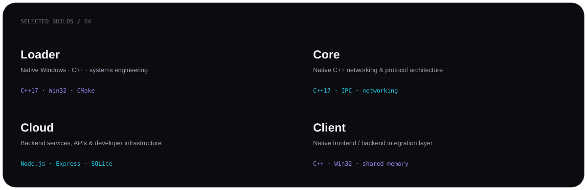
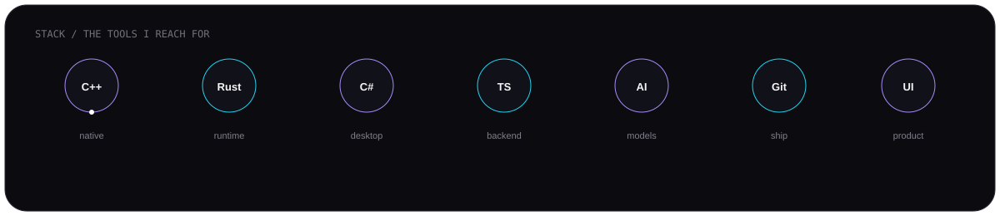
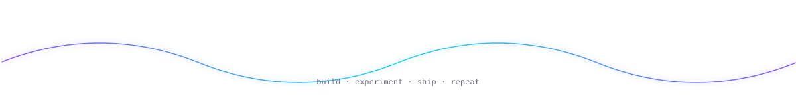

<a href="mailto:nd506970@gmail.com">Email</a>
&nbsp;&nbsp;·&nbsp;&nbsp;
<a href="https://github.com/Athang-codes?tab=repositories">Projects</a>
&nbsp;&nbsp;·&nbsp;&nbsp;
<a href="https://github.com/Athang-codes">GitHub</a>

 

## Hey, I'm Athang 👋

I'm a developer who likes building things from the inside out.

I work across **native software, developer tooling, backend systems and AI/LLM experiments**. Most of my learning happens by turning an idea into a real project, breaking it, understanding why it broke, and rebuilding it better.

### What I'm into

<table>
<tr>
<td width="33%" valign="top">

**SYSTEMS**

C++  
Rust  
Windows / native software  
performance & architecture

</td>
<td width="33%" valign="top">

**AI**

LLMs  
model tooling  
runtime experiments  
AI engineering

</td>
<td width="33%" valign="top">

**PRODUCT**

desktop UI  
backend services  
web apps  
developer experience

</td>
</tr>
</table>

---

## Currently building

---

## A few things I've built

<a href="https://github.com/Athang-codes?tab=repositories">see all repositories →</a>

---

## Tools I use

---

## GitHub

  

---

### Build → break → understand → ship

<a href="mailto:nd506970@gmail.com">nd506970@gmail.com</a>

  

curious by default · building by choice

