 

  
  
  

---

## 01 / About

I'm **Athang** — a developer who likes understanding what happens underneath the interface.

I move between **native software, developer tooling, backend systems and AI experiments**, usually learning by building something real and then pushing it until I understand where the edges are.

> **Ideas are cheap. Building the system is the fun part.**

---

## 02 / Current Focus

<table>
<tr>
<td width="33%" valign="top">

### ◈ AI

LLMs  
Model tooling  
Runtime systems  
AI engineering

</td>
<td width="33%" valign="top">

### ◈ Systems

C++  
Rust  
Performance  
Native Windows

</td>
<td width="33%" valign="top">

### ◈ Product

Desktop UI  
Backend architecture  
Web apps  
Developer tools

</td>
</tr>
</table>

---

## 03 / Repository Constellation

---

## 04 / Selected Builds

 

  More experiments live across my public repositories → <a href="https://github.com/Athang-codes?tab=repositories">browse all repositories</a>

---

## 05 / Technologies

  

<code>C++</code> · <code>Rust</code> · <code>C#</code> · <code>TypeScript</code> · <code>JavaScript</code> · <code>Python</code> · <code>Java</code> 
<code>CMake</code> · <code>Node.js</code> · <code>React</code> · <code>Next.js</code> · <code>OpenGL</code> · <code>Dear ImGui</code> · <code>MongoDB</code> · <code>Supabase</code>

---

## 06 / GitHub Telemetry

  

---

## 07 / Contribution Matrix

<picture>
  <source media="(prefers-color-scheme: dark)" srcset="https://raw.githubusercontent.com/Athang-codes/Athang-codes/output/github-contribution-grid-snake-dark.svg">
  <source media="(prefers-color-scheme: light)" srcset="https://raw.githubusercontent.com/Athang-codes/Athang-codes/output/github-contribution-grid-snake.svg">
  
</picture>

---

## 08 / Build Loop

<table>
<tr><td align="center">
<b>IDEA</b> → <b>ARCHITECTURE</b> → <b>PROTOTYPE</b> → <b>BREAK / DEBUG</b> 
↓ 
<b>UNDERSTAND</b> → <b>IMPROVE</b> → <b>SHIP</b> → ↺
</td></tr>
</table>

I don't want to only use technology — I want to understand **why it works, where it breaks, and how to make it better.**

---

## 09 / Connect

  

Curious about how things work. Obsessed with building them.

